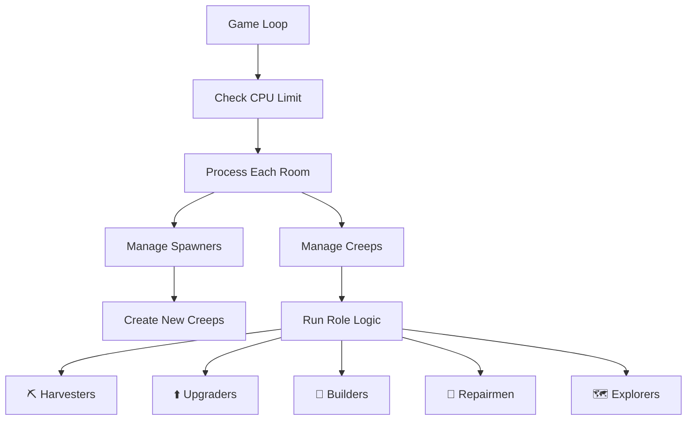

# 🏗️ Screeps AI Colony Manager

A sophisticated AI colony management system for Screeps, designed to efficiently manage your colony's creeps and structures. This AI focuses on modular design, clear role separation, and efficient resource management.

## 🏗️ Project Structure

```
screeps-ai/
├── 📄 creep.base.js         # Base class for all creep roles
├── 🎮 creep.manager.js      # Manages all creeps and their roles
├── 🏷️ creep.status.js       # Status constants for creep states
├── 🏁 main.js               # Main game loop and initialization
├── 📝 notes.spawning.js     # Notes and planning for spawning logic
├── 🔨 role.builder.js       # Builder role implementation
├── 🗺️ role.explorer.js      # Explorer role implementation
├── ⛏️ role.harvester.js     # Harvester role implementation
├── 🔧 role.repairman.js     # Repairman role implementation
├── ⬆️ role.upgrader.js      # Upgrader role implementation
└── 🏗️ struct.spawner.js    # Spawner structure management
```

## 🤖 Roles Overview

### 1. ⛏️ Harvester
- **Purpose**: Collects energy from sources
- **Body Parts**: `[WORK, WORK, CARRY, MOVE]`
- **Minimum Count**: 3
- **Behaviors**:
  - 🏃 Harvests energy when not full
  - 🔄 Transfers energy to structures when full
  - 🔋 Automatically recharges when empty

### 2. ⬆️ Upgrader
- **Purpose**: Upgrades the controller
- **Behaviors**:
  - 💰 Collects energy from storage
  - ⬆️ Upgrades the room controller
  - ⚡ Manages energy efficiently

### 3. 🔨 Builder
- **Purpose**: Constructs structures
- **Behaviors**:
  - 🏗️ Builds construction sites
  -  Manages construction queue

### 4. 🔧 Repairman
- **Purpose**: Maintains and repairs structures
- **Behaviors**:
  - 🔍 Identifies damaged structures
  - ⚠️ Prioritizes critical repairs (Lowest HP First)
  - 🛠️ Manages repair resources

### 5. 🗺️ Explorer
- **Purpose**: Scouting and expanding to new rooms
- **Behaviors**:
  - 🧭 Explores new territories
  - 📡 Maps room layouts
  - 🔍 Identifies resources and threats
  - ⚔️ Fights enemies

## 🔄 System Architecture



## 🛠️ Installation (Not Implemented yet so just paste the files into your screeps game)

1. Ensure you have Node.js and npm/yarn installed
2. Clone this repository
3. Install dependencies:
   ```bash
   yarn install
   ```
4. Configure your Screeps credentials
5. Deploy the code to your Screeps account

## 🚀 Features

- 🧩 **Modular Design**: Each role is self-contained and follows a consistent pattern
- ⚡ **Efficient CPU Usage**: Built-in CPU monitoring and optimization
- 👶 **Automatic Spawning**: Intelligent creep spawning based on colony needs
- 💊 **Self-Healing**: Automatic creep replacement and recycling
- 🎯 **Status-Based AI**: Clear state management for each creep
- 🔄 **Priority System**: Smart role prioritization for optimal resource management

## 🤝 Contributing

We welcome contributions! If you'd like to improve this AI, feel free to:

1. Fork the repository
2. Create a new branch for your feature
3. Submit a pull request

Join our community on Discord: [Kaizen Apps Screeps Community](https://discord.gg/ZExWJzMGhu)

## 📝 License

This project is open source and available under the MIT License.

## 📊 Performance Metrics

- ⏱️ CPU Usage: Optimized to stay under 50% of bucket
- 📈 Creep Efficiency: 95%+ uptime on critical roles
- 🔄 Self-Sustaining: Can recover from complete colony loss

## 📈 Future Improvements

- [ ] Implement remote room operations
- [ ] Add more advanced combat roles
- [ ] Improve energy distribution
- [ ] Add more sophisticated room planning
- [ ] Implement automatic room claiming
- [ ] Add market trading functionality

---

Built with ❤️ by the [Kaizen Apps](https://kaizenapps.com) Screeps community | [Join our Discord](https://discord.gg/ZExWJzMGhu)
